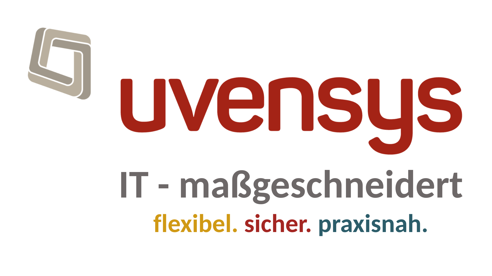
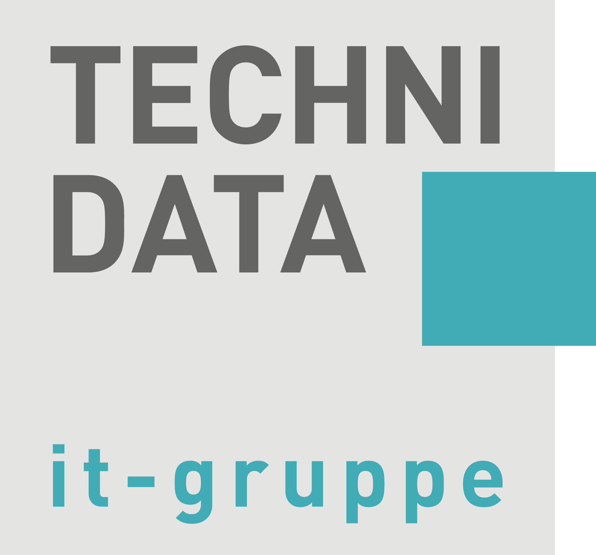

<p align="center">
  <picture>
    <!-- GitHub dark mode → swap to light variant so it stays readable -->
    <source media="(prefers-color-scheme: dark)" srcset="images/pegaprox-logo-light.png">
    
  </picture>
</p>

<h1 align="center">Makus Virt</h1>

<p align="center">
  <strong>Proxmox VE &amp; XCP-ng 멀티 클러스터 통합관리 — 한국 실정에 맞춘 오픈소스 에디션</strong>
</p>

<p align="center">
  <a href="https://github.com/dskim1979/makus-virt/releases">Releases</a> •
  <a href="https://github.com/dskim1979/makus-virt/issues">Issues</a> •
  <a href="#-이-포크에-대해">이 포크에 대해</a> •
  <a href="https://pegaprox.com">원본 프로젝트 (PegaProx)</a>
</p>

<p align="center">
  
  
  
  
</p>

<p align="center">
  <a href="https://app.aikido.dev/audit-report/external/aklfeBsCvIheXnWMwFRveeH5/request" target="_blank">
    
  </a>
</p>
---

## 🇰🇷 이 포크에 대해

**Makus Virt**는 오픈소스 프로젝트 [PegaProx](https://github.com/PegaProx/project-pegaprox)(AGPL-3.0)를 포크하여, **Makus Systems**가 한국 시장에 맞게 로컬라이즈·유지보수하는 에디션입니다.

- 🇰🇷 **한국어 전용 UI** — 다국어 지원 대신 한국어에 완전히 집중
- 💰 **원화(KRW) 기반 비용 대시보드** — 국내 전기요금·컴퓨트 비용 산정 기준 반영
- 🎨 **화이트라벨 지원** — 로고·파비콘·앱 이름을 배포 환경에 맞게 커스터마이징 가능
- 📜 **AGPL-3.0 그대로 유지** — 원저작자(PegaProx Team) 표시 및 라이선스 의무를 그대로 준수

이 포크 자체는 별도로 후원을 받지 않습니다. Makus Virt가 유용하셨다면, 아래 **PegaProx 원 개발팀을 후원**해주세요 — 이 프로젝트가 존재할 수 있는 건 전적으로 그분들 덕분입니다.

기업용 상용 지원이 필요하시면 별도 파트너십 제품을 통해 제공되며, 이 저장소와는 무관합니다.

## 🚀 What is PegaProx?

PegaProx is a powerful web-based management interface for Proxmox VE and XCP-ng clusters. Manage multiple clusters from a single dashboard with features like live monitoring, VM management, automated tasks, and more.

<p align="center">
  
</p>

### 🪽 What's in the name?

The name **PegaProx** is inspired by *Pegasus*, the winged horse of Greek mythology, combined with *Prox* as a reference to Proxmox VE. Pegasus symbolises speed, freedom and elegant flight — qualities we aspire to bring to multi-cluster hypervisor management.

## ❤️ Sponsors

> PegaProx is a community-driven open source project that **lives entirely from sponsorships and donations**. Server costs, domains, code-signing certificates and the developer hours behind every release come straight out of our own pockets — and out of the contributions of the wonderful companies and individuals below. If PegaProx saves you time at work, please consider [becoming a sponsor](mailto:sponsor@pegaprox.com) or chipping in on [Open Collective](https://opencollective.com/pegaprox). Every euro keeps the lights on. 💛
>
> **Makus Virt 안내**: 이 포크는 별도로 후원을 받지 않습니다. 아래 후원 정보는 전부 원본 **PegaProx** 프로젝트로 연결됩니다 — Makus Virt가 존재할 수 있는 건 이분들의 작업 덕분입니다.

### 💎 Platinum

<p align="center">
  <a href="https://www.netwolk.ch">
    
  </a>
  &nbsp;&nbsp;&nbsp;
  <a href="https://expertize.nl/">
    
  </a>
  &nbsp;&nbsp;&nbsp;
  <a href="https://netzware.at/">
    
  </a>
  &nbsp;&nbsp;&nbsp;
  <a href="https://www.occentus.net/">
    
  </a>
</p>

### 🥇 Gold

<p align="center">
  <a href="https://socialfurr.com">
    
  </a>
</p>

### 🥈 Silver

<p align="center">
  <a href="https://uvensys.de/">
    
  </a>
  &nbsp;&nbsp;
  <a href="https://www.datimo.ch/">
    
  </a>
  &nbsp;&nbsp;
  <a href="https://www.technidata.de/">
    
  </a>
</p>

### 🥉 Bronze

<p align="center">
  <a href="https://idkmanager.com/">
    
  </a>
  <a href="https://www.linet-services.de/">
    
  </a>
</p>

<p align="center">
  <sub><b>Individual supporters:</b>&nbsp; Andreas Huemmer</sub>
</p>

<p align="center">
  <a href="mailto:sponsor@pegaprox.com">Become a Sponsor</a> •
  <a href="https://opencollective.com/pegaprox">Open Collective</a> •
  <a href="https://pegaprox.com/sponsors.html">Commercial Support</a>
</p>

## ✨ Features

### Multi-Cluster Management
- 🖥️ **Unified Dashboard** - Manage all your Proxmox clusters from one place
- 📊 **Live Metrics** - Real-time CPU, RAM, and storage monitoring via SSE
- 🔄 **Live Migration** - Migrate VMs between nodes with one click
- ⚖️ **Cross-Cluster Load Balancing** - Distribute workloads across clusters
- 🔄 **Cross-Hypervisor Migration** - Migrate VMs between ESXi, Proxmox VE, and XCP-ng 

### VM & Container Management
- ▶️ **Quick Actions** - Start, stop, restart VMs and containers
- ⚙️ **VM Configuration** - Edit CPU, RAM, disks, network, EFI, Secure Boot & more
- 📸 **Snapshots** - Standard and space-efficient LVM snapshots for shared storage
- 🔁 **Snapshot Replication** - Storage-agnostic replication for clusters without ZFS
- 💾 **Backups** - Schedule and manage backups
- ✅ **Backup Verification** *(Experimental)* - Automated restore → boot → health check → cleanup (ISO 27001, SOC 2, HIPAA compliance)
- 🖱️ **noVNC / xterm.js Console** - Browser-based console for QEMU and LXC
- ⚖️ **Load Balancing** - Automatic VM distribution across nodes
- 🔁 **High Availability** - Auto-restart VMs on node failure with configurable timing
- 📍 **Affinity Rules** - Keep VMs together or apart on hosts (QEMU + LXC)

### XCP-ng Integration (Tech Preview)
- 🟢 **XCP-ng Pool Support** - Connect XCP-ng / Xen hypervisor pools alongside Proxmox clusters
- ▶️ **VM Power Actions** - Start, stop, shutdown, reboot, suspend/resume
- 🖥️ **VNC Console** - Browser-based remote console via XAPI
- 💽 **Disk & Network Management** - Add, resize, remove disks and NICs
- 🔧 **Maintenance Mode** - Enter/exit with automatic VM evacuation

### ESXi Migration
- 🔀 **ESXi Import Wizard** - Migrate VMs from ESXi hosts to Proxmox
- ⚡ **Near-Zero Downtime** - Transfer running VMs with minimal interruption (max. 1 VM recommended)
- 🔌 **Offline Migration** - Shut down and transfer for maximum reliability
- 🔑 **SSH Required** - ESXi host must have SSH enabled

### Security & Access Control
- 👥 **Multi-User Support** - Role-based access control (Admin, Operator, Viewer) + custom roles
- 🛠️ **API Token Management** - Create, list, and revoke Bearer tokens (scoped per role)
- 🔐 **2FA Authentication** - TOTP-based two-factor authentication (with force option)
- 🔑 **WebAuthn / FIDO2** - Hardware-key login (YubiKey, Nitrokey, Touch ID, Windows Hello) — passwordless or as 2FA factor
- 🏛️ **LDAP / OIDC** - Active Directory, OpenLDAP, Entra ID, Keycloak, Google Workspace, Authentik (with PKCE)
- 🛡️ **VM-Level ACLs** - Fine-grained permissions per VM
- 🏢 **Multi-Tenancy** - Isolate clusters for different customers
- 🚫 **IP Whitelisting / Blacklisting** - Restrict access by IP or CIDR range
- 🔒 **Full-DB Encryption** - SQLCipher (AES-256-CBC + HMAC-SHA512, format v4) wraps the entire database at rest on Linux x86_64; sensitive fields stay individually Fernet-encrypted everywhere else. Multi-tier master-key loader resolves from env / systemd LoadCredentialEncrypted / `/etc/pegaprox/secret.key`, so a `config/` backup never carries the key alongside the data. Auto-migrates plain DBs on first boot post-update.
- 🔍 **CVE Scanner** - Per-node package vulnerability scanning via debsecan
- 🛡️ **CIS Hardening** - One-click security audit and hardening against CIS benchmarks
- 🧾 **HMAC-Signed Audit Log** - Tamper-evident integrity verification on every entry

### Automation & Monitoring
- ⏰ **Scheduled Tasks** - Automate VM actions (start, stop, snapshot, backup)
- 📸 **Snapshot Schedules** - Tag-based or VMID-list snapshot policies with retention pruning (hourly / daily / weekly + “keep last N” + “keep N days”)
- 🔄 **Rolling Node Updates** - Update cluster nodes one by one with automatic evacuation
- 🚨 **Alerts** - Get notified on high CPU, memory, or disk usage
- 📜 **Audit Logging** - Track all user actions with IP addresses
- 🔎 **Audit Search** - Full-text + date-range + severity + IP filter, paginated, CSV export
- 🛰️ **SIEM Forwarder** - Stream audit events to Syslog (UDP/TCP RFC 5424), Splunk HEC, Elasticsearch, Loki, or generic webhooks. VAPID-style per-target TLS verification.
- 🔧 **Custom Scripts** - Run scripts across nodes
- 💿 **Ceph Management** - Monitor and manage Ceph storage pools, RBD mirroring
- 🔐 **ACME / Let's Encrypt** - Automatic SSL certificate renewal with HTTP-01 challenge (+ custom ACME CAs)
- 📋 **Integrated Syslog Server** - Receive and view syslog messages (UDP/TCP) with filtering, search, and severity-based coloring
- 🧬 **Config Drift Detection** - Nightly snapshot of cluster config (VM configs, storage.cfg, network, datacenter options) — alerts on any unauthorized change vs the admin-set baseline. Pairs with the Compliance Dashboard.

### Reports & Analytics
- 💰 **Cost Dashboard / Chargeback** - €/VM/Month from real metrics (CPU-h × node tariff + RAM-GB-h + Storage-GB-month). Currency-configurable, per-cluster rates, top-spender table, by-node breakdown. CSV + PDF export.
- ⚡ **Power & Carbon Tracking** - Estimated kWh + €/Month + kg CO₂/Month per VM, based on metrics history × node-power profile × PUE × grid CO₂ intensity. Defaults for DE/EU; admin-tunable for any hardware/grid. CSV + PDF export.
- 🧠 **Insights** - Right-sizing recommendations (oversized / undersized CPU + RAM, idle VMs) and capacity forecasts (linear regression + ETA to threshold) over 30 days of history. PDF export.
- 🌐 **Network Topology Visualization** - Interactive SVG graph: Cluster → Nodes → Bridges/Bonds/SDN VNets → VMs. Click to highlight connections.
- 📊 **Compliance Dashboard** - Read-only BSI Grundschutz / ISO 27001 / NIS2 / SOC 2 mapping per cluster, hardening score, exportable PDF. Visible to ops/auditors without admin rights.
- 🛡️ **CVE Reporting** - Per-cluster severity counts + per-package detail + historical view of when each CVE first appeared.

### Operations & Deployment
- ☁️ **Cloud-Init Template Library** - Curated catalog (Ubuntu 22.04/24.04, Debian 11/12, AlmaLinux 9, Rocky 9, Fedora 40, Alpine 3.19) plus admin-defined custom templates. One-click deploy to any cluster (download → import → cloudinit drive → convert to template).
- 🚑 **Site Recovery** - Configure DR plans (boot order, dependencies, replication mappings) and execute controlled failover with audit trail.
- 📦 **Backup SLA Tracking** - SLA dashboard per cluster + datastore: last-backup age vs configured RPO, integrated with the Alert pipeline.
- 🔁 **ZFS / Cross-Cluster Replication** - Native PVE replication monitor + cross-cluster replication for clusters without shared storage.
- 🛠️ **V2P / ESXi Migration** - Pyvmomi + SSHFS-based, with VirtIO driver pre-staging via MSI bulk-install (Windows guests).

### Notifications
- 📢 **Webhook Channels** - Slack, Discord, Microsoft Teams, ntfy, generic JSON webhooks (multi-channel, per-alert routing)
- 🔔 **Web Push Notifications** - Browser push via VAPID, “wake-up” pattern (no payload leaks to push provider). Inbox view in the topbar bell with unread badge.
- 📲 **PWA / Installable App** - Service Worker shell-cache, offline boot, install prompt, theme-color matching layout.

### Plugins
- 🌐 **Client Portal** - Self-service portal for hosting customers with VM power actions, noVNC console, snapshots, ISO mount, snapshot policies (read-only), 2FA, and password management
- 📊 **Public Status Page** - Cluster health dashboard for monitoring screens with URL-based auth key (no login required)
- 🔔 **Notifications Plugin** - ntfy + Apprise integration for unified channel routing
- 🐳 **Docker Swarm Manager** *(Community)* - Manage Swarm services from the same UI
- 🗄️ **TrueNAS SCALE Manager** *(Community)* - Monitor and administer TrueNAS SCALE (pools, datasets, snapshots, SMB/NFS shares, replication, apps/VMs, services, data-protection posture, telemetry) over JSON-RPC 2.0
- 🔌 **Plugin Config Editor** - Edit plugin configuration directly from the UI

### Advanced Features
- 🌐 **Offline Mode** - Works without internet (local assets, air-gap mode disables external CVE/sponsor lookups for VS-NfD / classified networks)
- 🎨 **Themes** - 17 themes including Dark/Light, Proxmox, Corporate (light/dark), Dracula, Nord, Monokai, Solarized, Cyberpunk, etc.
- 🏢 **Corporate Layout** - Tree-based sidebar with dense tables
- 🌍 **Multi-Language** - English, German, French, Spanish, Portuguese, Korean, Italian, Simplified Chinese
- 📱 **Responsive + PWA** - Works on desktop and mobile, installable as native-feeling app
- 📦 **PBS Integration** - Proxmox Backup Server management with backup verification
- 🔭 **Prometheus Exporter** - Scrape `/api/metrics` with bearer auth for cluster + VM metrics

## 📋 Requirements

- Python 3.8+
- Proxmox VE 8.0+ or 9.0+ and/or XCP-ng 8.2+
- Modern web browser (Chrome, Firefox, Edge, Safari)

## ⚡ Quick Start / Installation

### Automated Installation
This installation method pulls the deployment script directly from the current HEAD of the main branch. This means you will always receive the latest available version, including the most recent features and improvements. However, because it is not tied to a specific release, it may also contain unreleased changes or bugs that have not yet been fully tested. If you prefer a stable and tested version, consider installing PegaProx from a tagged release instead.

```bash
curl -O https://raw.githubusercontent.com/PegaProx/project-pegaprox/refs/heads/main/deploy.sh
chmod +x deploy.sh
sudo ./deploy.sh
```

### Debian Repository
> ⚠️ **Makus Virt 사용 시 참고**: 아래 APT 저장소·Docker 이미지는 **원본 PegaProx**의 공식 배포 채널입니다. Makus Virt는 아직 별도 패키지 저장소/Docker 이미지를 운영하지 않으므로, `apt-get install pegaprox`나 `ghcr.io/pegaprox/pegaprox`를 그대로 쓰면 Makus Virt가 아닌 **원본 PegaProx가 설치됩니다.** Makus Virt를 쓰시려면 아래 [Manual Installation](#manual-installation) 섹션에서 이 저장소(`dskim1979/makus-virt`)를 clone하세요.

This installation method uses the official APT repository provided by gyptazy. The repository and its associated build and packaging pipeline are fully hosted and maintained by <a href="https://github.com/gyptazy">gyptazy</a>, where PegaProx releases are automatically built and published as Debian packages. Unlike the automated installation script, which pulls the latest code directly from the repository branch, the APT repository distributes packaged and versioned releases. This generally provides a more stable and predictable installation, making it the recommended approach for production environments.
```bash
curl https://git.gyptazy.com/api/packages/gyptazy/debian/repository.key -o /etc/apt/keyrings/gyptazy.asc
echo "deb [signed-by=/etc/apt/keyrings/gyptazy.asc] https://packages.gyptazy.com/api/packages/gyptazy/debian trixie main" | sudo tee -a /etc/apt/sources.list.d/gyptazy.list
apt-get update

apt-get -y install pegaprox
```

## Installation from Source
This installation methods run PegaProx directly from the source code repository. It is primarily intended for development, testing, or advanced users who want full control over the codebase or want to modify and extend the project.

By default, cloning the repository will pull the latest state of the main branch, which contains the most recent changes and features. While this ensures you always have the newest code available, it may also include in-progress changes that are not part of an official release yet.
If you prefer a more stable version, you can optionally checkout a specific release tag from the repository before installing dependencies and starting the application. This allows you to run the exact code corresponding to an official release while still using the source-based installation method.

Running PegaProx from source can be useful for debugging, contributing to the project, or integrating custom functionality, since you have direct access to the entire codebase and can easily update it using standard Git workflows.

### Manual Installation

**Makus Virt (이 저장소):**
```bash
git clone https://github.com/dskim1979/makus-virt.git
cd makus-virt
pip install -r requirements.txt
bash web/Dev/build.sh   # 프론트엔드 빌드 (최초 1회 + 소스 수정 시마다)
python3 pegaprox_multi_cluster.py
```

**원본 PegaProx:**
```bash
git clone https://github.com/PegaProx/project-pegaprox.git
cd project-pegaprox
pip install -r requirements.txt
python3 pegaprox_multi_cluster.py
```

### Docker
> ⚠️ 아래 Docker 예시는 원본 PegaProx 이미지(`ghcr.io/pegaprox/pegaprox`) 기준입니다. Makus Virt는 아직 자체 Docker 이미지가 없으니, "For local builds" 항목처럼 이 저장소를 직접 clone해서 빌드하는 방식을 이용하세요.

```bash
docker compose up -d
```

Or without Compose:
```bash
docker run -d --name pegaprox \
  -p 5000:5000 -p 5001:5001 -p 5002:5002 \
  -v pegaprox-config:/app/config \
  -v pegaprox-logs:/app/logs \
  --restart unless-stopped \
  ghcr.io/pegaprox/pegaprox:latest
```

For local builds (Makus Virt):
```bash
git clone https://github.com/dskim1979/makus-virt.git
cd makus-virt
docker build -t makus-virt .
docker run -d --name makus-virt \
  -p 5000:5000 -p 5001:5001 -p 5002:5002 \
  -v makus-virt-config:/app/config \
  -v makus-virt-logs:/app/logs \
  --restart unless-stopped \
  makus-virt
```

### Debian Package (.deb build)
```bash
git clone https://github.com/PegaProx/project-pegaprox.git
cd project-pegaprox

dpkg-buildpackage -us -uc
sudo dpkg -i ../pegaprox_*.deb
```

## 🔄 Updating

**Option 1: Update Script (Recommended)**
```bash
cd /opt/PegaProx
curl -O https://raw.githubusercontent.com/PegaProx/project-pegaprox/refs/heads/main/update.sh
chmod +x update.sh
sudo ./update.sh
```

**Option 2: Web UI**

Go to Settings → Updates and click "Check for Updates".

## 🔧 Configuration

After starting PegaProx, open your browser and navigate to:

```
https://your-server-ip:5000
```

Default credentials:

```
Username: pegaprox
Password: admin
```

1. **First Login**: Create your admin account on the setup page
2. **Add Cluster**: Go to Settings → Clusters → Add your Proxmox credentials
3. **Done!** Start managing your VMs

## 📁 Directory Structure

```
/opt/PegaProx/
├── pegaprox_multi_cluster.py   # Entry point
├── pegaprox/                   # Application package
│   ├── app.py                  # Flask app factory
│   ├── constants.py            # Configuration constants
│   ├── globals.py              # Shared state
│   ├── api/                    # REST API blueprints
│   ├── core/                   # Business logic (manager, db, cache)
│   ├── background/             # Background tasks (scheduler, alerts)
│   ├── utils/                  # Utilities (auth, RBAC, LDAP, OIDC)
│   └── models/                 # Data models
├── web/
│   ├── index.html              # Compiled frontend
│   └── src/                    # Frontend source (JSX)
├── config/
│   └── pegaprox.db             # SQLite database — fully encrypted at rest via SQLCipher (Linux x86_64); plain SQLite + Fernet-encrypted fields elsewhere
├── static/                     # JS/CSS libraries (offline mode)
├── logs/                       # Application logs
└── update.sh                   # Update script
```

## 🔒 Security

- **Database at rest** → SQLCipher (AES-256-CBC + HMAC-SHA512, SQLCipher format v4) on Linux x86_64. Plain SQLite + per-field Fernet on other platforms (ARM / macOS / Windows). See [`docs/SECURITY.md`](docs/SECURITY.md) for the threat model and recovery story.
- **Master key custody** → Multi-tier loader: `PEGAPROX_DB_KEY` env / systemd `LoadCredentialEncrypted` (TPM2-bound) / `/etc/pegaprox/secret.key` / `~/.config/pegaprox/secret.key` / legacy `config/`. Default chmod 0600, files with loose permissions are skipped rather than used silently.
- **Sensitive fields** (Cluster PW, SSH keys, TOTP secrets, OIDC client secrets, LDAP bind) → Fernet (AES-256-GCM equivalent), works even when full-DB encryption isn't available.
- **API Tokens** → SHA-256 hash (constant-time compare).
- **Passwords** → Argon2id (3 iter, 64 MB memory cost).
- HTTPS required for production.
- Session tokens expire after inactivity; optional strict-IP binding.
- Per-IP rate limiting on login + every authenticated endpoint.
- Input sanitization, CSRF Origin matching, RBAC enforced server-side on every route.
- Auto-encryption on first boot — operators can opt out with `PEGAPROX_DISABLE_AUTO_ENCRYPT=1` if they want to take their own pre-encryption backup first.

## 📖 Documentation

Full documentation is available at **[docs.pegaprox.com](https://docs.pegaprox.com)** (원본 PegaProx 문서 — Makus Virt 전용 한국어 문서는 준비 중입니다)

## 📜 License

This project is licensed under the AGPL-3.0 License - see the [LICENSE](LICENSE) file for details.

**Attribution (AGPL §7b):** Under Section 7(b) of the AGPL, the **"Powered by PegaProx"** attribution shown in the client portal is a *required* author attribution and must be preserved in every copy and modified/derivative version — see the [NOTICE](NOTICE) file. Note also that AGPL §13 requires anyone hosting a **modified** version for network users to publish that version's complete source to those users. PegaProx is AGPL-3.0 only — the attribution applies to everyone, without exception.

Makus Virt는 이 요건을 그대로 준수하며, 수정된 소스 전체를 이 저장소를 통해 공개하고 있습니다.

## 💬 Support

**Makus Virt (이 포크) 관련 문의:**
- 📧 Email: support@makusvirt.example.com
- 🐛 Issues: [GitHub Issues](https://github.com/dskim1979/makus-virt/issues)

**원본 PegaProx 커뮤니티/코어 기능 문의:**
- 💬 Discord: [Community Server](https://discord.gg/AJPf3H62QW)
- 📧 Email: support@pegaprox.com
- 🐛 Issues: [GitHub Issues](https://github.com/PegaProx/project-pegaprox/issues)

## 🤖 Development Tools

Like most modern dev teams, we use AI-assisted tooling (code completion, docs generation, review automation, security audits). All architecture decisions, implementation, and testing are handled by our three-person team. — see [IBM](https://www.ibm.com/solutions/ai-coding) , [IBM Case Studies](https://www.ibm.com/case-studies/ibm-software-team) , [MIT Tech Review](https://www.technologyreview.com/2025/12/15/1128352/rise-of-ai-coding-developers-2026/)

AI-driven security auditing is an industry-standard practice — see [Hacker News](https://thehackernews.com/2026/02/claude-opus-46-finds-500-high-severity.html), [IBM Research](https://www.ibm.com/think/insights/chatgpt-4-exploits-87-percent-one-day-vulnerabilities).

## ⭐ Star History

If you find PegaProx useful, please consider giving it a star! ⭐

---

<p align="center">
  Made with ❤️ by the PegaProx Team
</p>
